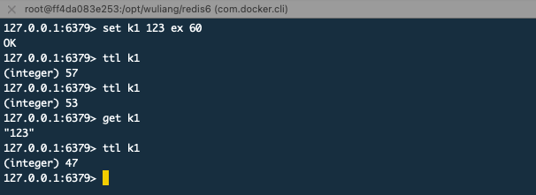
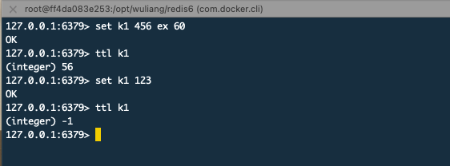

## 一、键(key)的有效期

1. 键的有效期会因为查找而延长吗？ 结论：是不会延长

   即对某一个key设置1分钟过期，在20秒的时候get了一次，过期时间是不会延长的

   

2. 键的有效期会因为修改而延长吗？结论：当某个key发生写操作时，会直接剔除过期时间

   也就是说，当更新key后，需要重新设置过期时间

   

3. key的过期判定原理：实践中，会结合下面两种方式设置

   * 被动：访问到key时判定，缺点是：会浪费内存

     这种情况下，key设置了过期时间，时间到了，还是在内存中；当被访问到时，判断已过期就会删除。当时有些key可能永远都访问不到了，这样就会一直占着内存。

   * 主动：周期时间轮询判定，缺点是：会消耗性能

     这种情况，就是会有一个任务定时的去扫描，发现有过期的就删除。具体如下：

     1. 随机选取20个keys进行相关的过期检测

     2. 删除这20个keys中所有过期的key

     3. 如果有多于25%的key过期，就重复步骤1

        

## 二、内存淘汰策略

在Redis配置文件中，maxmemory 可以设置内存大小。在有限的内存中，肯定会有被占满的时候。那么当内存达到限制的大小时，怎么办呢？这就需要一定的算法(回收策略)来处理。

### 回收策略

当maxmemory限制达到的时候Redis会使用的行为由 Redis的maxmemory-policy配置指令来进行配置。

1. **noeviction**:返回错误；（当Redis作为数据库使用时，推荐此策略）
2. **allkeys-lru**: 尝试回收最少使用的
3. **volatile-lru**: 在已过期的键中，尝试回收最少使用的
4. **allkeys-random**: 随机回收
5. **volatile-random**:  在已过期的键中，随机回收

