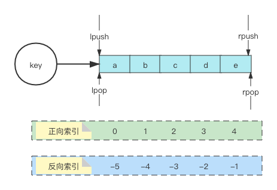
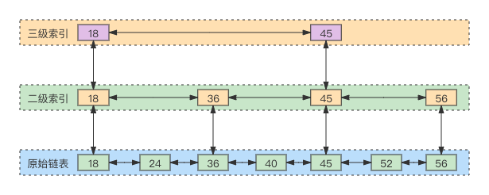
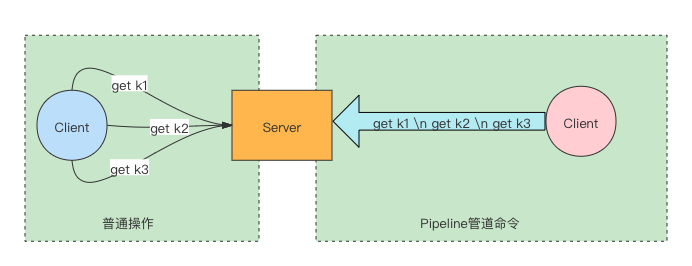
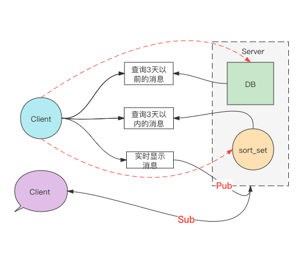

Redis结构表示


## 一、Redis 键(Key) 构成

```c
typedef struct redisObject { 
	unsigned type:4;//类型 五种对象类型  REDIS_STRING(字符串)、REDIS_LIST (列表)、REDIS_HASH(哈希)、REDIS_SET(集合)、REDIS_ZSET(有序集合)。
	unsigned encoding:4; //编码 4表示位数
	void *ptr;//指向底层实现数据结构的指针,指向具体数据
	//... 
	int refcount;//引用计数 
	//... 
	unsigned lru:LRU_BITS; //LRU_BITS为24bit 记录最后一次被命令程序访问的时间 
        //高16位存储一个分钟数级别的时间戳&#xff0c;低8位存储访问计数&#xff08;lfu &#xff1a; 最近访问次数&#xff09;
	//... 
} robj;
```

1. 查看对象类型 `type key`

   

2. 获取value具体编码 `object encoding key`

   

   > 可以看出，value为string类型的，编码可以有3种：`embstr`，`int`，`raw`；当字符串长度大于44(整个sds总体超过64)时，就用raw存储。sds结构自身占用19个字节，字符串结尾标识"\0"占一个字节，所以**64 - 19 -1 = 44**

3. 查看key的结构信息 `debug object key`

   

## 二、Redis二进制安全

1.  什么是二进制安全？

   二进制安全就是指，在传输数据时，保证二进制数据的信息安全，即不被篡改、破译等。简单来说，就是只关心二进制化的字符串，不关心具体格式，只会严格的按照二进制数据存取，不会妄图以某种特殊格式解析数据。例如：在C语言中，就以"\0"来判定字符串的结尾。

2. Redis是如何保证二进制安全的？

   ```c
   struct sdshdr{
           int len;//buf数组中已经使用的字节的数量,也就是SDS字符串长度
           int  free;//buf数组中未使用的字节的数量
           char buf[];//字节数组,字符串就保存在这里面
   };
   ```

   Redis 通过定义上述结构体的方式，扩展了C语言底层字符串的缺点；不再像C语言那样，以"\0"作为字符串的结尾，而是使用了独立的`len`字段来表示字符串的长度。这样就避免了如果字符串中出现"\0"而被截取忽略后面字符串的问题；保证了二进制安全。

   > 基于此，Redis的string可以支持各种类型(图片、视频、文本等)；而C语言的字符串就只能存储文本格式的数据。

   

3. Redis的简单动态字符串SDS对比C语言中的字符串char，有什么优势？

   * 可以在O(1)的时间复杂度得到字符串的长度 (sds结构中，len字段直接记录了长度)

   * 二进制安全 

   * 可以高效的追加字符串操作

     原理：sds会判断当前字符串空余(free)的长度与需要追加的字符串长度；如果空余大于需要追加，就会直接追加，减少了重新分配内存的操作；如果空余小于需要追加，那么就先对sds进行扩展，然后再追加；只是这里扩展内存是按照一定的机制进行的，扩展后多余的空间不释放，方便下次追加字符串，会造成一定的内存浪费，但是在频繁追加操作下，这种机制就很高效。

4. SDS 内存扩展机制

   在已经分配的内存低于1M时，每次扩容都是以现有内存2倍的方式扩容；当超过1M时，每次只扩容1M

## 三、5种基本数据类型

### 1、字符串—string

 1). 常见命令

```tex
set get | mset mget | setrange getrange | getset | append | strlen

incr decr | incr by decrby |

setbit getbit | bitcount | bitop | bitpos
```

 2). 使用场景

* 计数器。如：文章浏览数、帖子点赞数等

  ```bash
  incr article:100.view # ID为100的文章，每打开一次，浏览次数增加1
  ```

* 分布式锁。如：秒杀活动中，商品库存问题

  ```bash
  set goods:100 1 EX 30 NX # 当key goods:100 不存在时拿到锁，并设置过期时间为30s
  ```

* 缓存。如果：热点数据的缓存

  ```bash
  set hotgoods:100 '{"id":100, "price": 998, "title": "鸟哥笔记"}' # 缓存热卖书籍基本信息
  ```

* 活跃用户数统计

  ```bash
  # 假如：某东 618 活动，需要为用户准备礼品；现需要统计最近三天活跃用户，用于备货
  # 通过bitmap，以日期为key记录用户的登录，然后拿对应日期做与运算，就很容易实现
  
  setbit 20210615 10 1  # 6月15号，ID为10的用户登录
  setbit 20210615 8 1   # 6月15号，ID为8的用户登录
  
  setbit 20210616 10 1  # 6月16号，ID为10的用户登录
  setbit 20210616 15 1  # 6月16号，ID为15的用户登录
  setbit 20210616 5 1   # 6月16号，ID为5的用户登录
  
  setbit 20210617 15 1  # 6月17号，ID为15的用户登录
  setbit 20210617 13 1  # 6月17号，ID为13的用户登录
  
  # 可以看出15、16、17号这三天，总共有5位用户活跃
  bitop or mau 20210615 20210616 20210617 # 会将计算结果以mau作为key存储
  bitcount mau # 结果为5
  ```

  

* 用户登录天数统计

  ```bash
  # 需求：需要统计某个用户某个时间段的登录天数
  # ID为88的用户，1月份中有登陆行为的天数；以1月1号为第1天，12月31号为第365天
  
  setbit login:88 0 1 # 第一天有登陆
  setbit login:88 8 1 # 第8天有登陆
  setbit login:88 12 1 # 第12天有登陆
  setbit login:88 13 1 # 第13天有登陆
  setbit login:88 20 1 # 第20天有登陆
  setbit login:88 25 1 # 第25天有登陆
  setbit login:88 27 1 # 第27天有登陆
  
  bitcount login:88 # 结果为：7
  ```

### 2、列表—list

> List， 元素可以重复，可以按照添加的先后保证顺序

1)、常用命令

```tex
lpush rpush | lpop rpop | blpop brpop | lrem linsert | llen | lrange | lindex
```

2)、使用场景

 * 栈 

   ```tex
   lpush
   lpop
   ```

 * 队列

   ```tex
   lpush
   rpop
   ```

 * 阻塞MQ

   ```tex
   lpush
   brpop
   ```



### 3、哈希—hash

1)、常用命令

 ```tex
 hset hget | hmset | hmget | hstrlen | hgetall | hlen | hincrby | 
 hincrbyfloat | hexists | hdel | hkeys
 ```

2)、使用场景

 * 存储对象信息

   ```bash
   # 存储用户信息；如姓名，年龄，地址等
   hmset uid:101 name zhangsan age 18 addr 北京
   ```

### 4、集合—set

> 集合中的元素会去重，保证不重复

 1)、常用命令

  ```tex
  sadd srem spop | sinter sdiff sunion| sinterstore sdiffstore sunionstore | 
  smembers | sismember | srandmember | scard
  ```

2)、使用场景

> 抽奖和关注模型两大类

 * 抽奖程序

   ```bash
   # 100张购物卡，共30人参与抽奖
   # 奖品大于抽奖人
   sadd k1 tom xxoo xoox xoxo oxxo ooxx oxox # 将30个参与抽奖的人添加到集合
   srandmember k1 -100 # 这里-100，会返回100个元素，随机重复
   
   # 公司年会抽奖，一等奖1  二等奖3  三等奖 5  中奖者会从参与者中剔除，不再参与其他奖项
   sadd k1 tom xxoo xoox xoxo oxxo ooxx oxox # 将参与抽奖员工添加到集合
   spop k1 1 # 一等奖 
   spop k1 3 # 二等奖
   spop k1 5 # 三等奖
   ```

 * 共同关注

   ```bash
   # 小王关注了：刘德华、罗大佑、郭富城、黎明
   # 小李关注了：黎明、张曼玉、马龙、张继科
   # 求小王和小李共同关注的人
   sadd k1 刘德华 罗大佑 郭富城 黎明
   sadd k2 黎明 张曼玉 马龙 张继科
   sinter k1 k2 # 结果为黎明
   ```

 * 猜你喜欢

   ```bash
   # 我关注了：刘德华、罗大佑、郭富城、黎明
   # 小王关注了：黎明、张曼玉、马龙、张继科
   # 当我进入小王的主页后，可以推荐我关注 张曼玉、马龙、张继科
   sadd k1 刘德华 罗大佑 郭富城 黎明
   sadd k2 黎明 张曼玉 马龙 张继科
   sdiff k2 k1 # 张曼玉 马龙 张继科
   ```

### 5、有序集合—sort_set

> 集合中数据去重，并可以按照给出的规则(一定的分值)排序

1)、常用命令

 ```bash
 zadd zrange zrangebyscore zcount | zincrby | zinterstore zunionstore | 
 zrevrange  zrevrangebyscore | zremrangebyscore
 ```

2)、使用场景

* 排行榜

  ```bash
  # 热点新闻，每点击一次，热搜值加1
  zincrby hotnews:20210822 1 汪峰开演唱会
  
  # 展示当天排行榜前十的热搜
  zrevrange hotnews:20210822 0 9 withscores
  
  # 计算最近3日热搜榜
  zunionstore unkey 3 hotnews:20210820 hotnews:20210821 hotnews:20210822
  
  # 从上述3日热搜榜中，展示前3
  zrevrange unkey 0 2 withscores
  ```

* 带有权重的队列


## 四、跳表(skip list)

跳表是一个特殊的链表，相比一般的链表有更高的查找效率；Redis中的有序列表就使用了这种结构



1. 查找 (例如：查找40)
   * 第一步拿目标40跟三级索引第一个节点18比较；由于40 大于 18，则跟18的下一个节点45进行比较，而40小于45
   * 通过第一步，可以知道目标40介于三级所以第一个节点和下一个节点之间，所以直接来到三级索引第一个节点18的二级索引
   * 此时在二级索引，40大于18的下一个节点36，则移动指针到36；由于40小于36的下一个节点45，所以将指针移动到二级索引36的上级原始链表
   * 此时发现，原始链表36的下一个节点复合条件
2. 插入节点
   * 新插入的节点和各级索引节点逐个比较，确定原始链表的位置(同上述查找过程)
   * 把新的数据插入到原始链表
   * 利用抛硬币的随机方式，决定是否将新的节点提升为上一级索引
3. 删除节点
   * 自上而下，查找第一次出现节点的索引，并逐层找到每一层对应的节点
   * 删除每一层找到的节点，如果该层只剩下一个节点，则删除整个层(原始链表除外)

## 五、管道（Pipeline）

​		当有多个命令(command)需要被及时提交，并且这些命令对相应结果没有互相依赖、对响应也无需立即获得；那么就可以使用管道来实现这种批处理。这在一定程度上可以提升性能，原因主要是TCP连接中减少了交互往返时间。假如有三条命令，单个提交就得需要3次往返；而使用管道批处理，只需要一次往返。Redis server 收到Pipeline发送过来的数据后，会以队列的形式放在内存中后，开始一条条的执行。



1. 注意事项

   * 可以为Pipeline操作新建Client连接，让其与其他正常操作隔离开在不同的Client连接中（由于Pipeline是独占连接的，所以在此期间是不可以进行其他操作的）
   * Pipeline所能容忍的操作数，和socket缓冲区大小有很大的关系，受限于server的物理内存和网络接口的缓冲能力
   * Pipeline只是让一批命令按顺序执行，不能保证原子性

2. 使用场景

   将数据库中的一批数据，一次性批量的存入Redis；可以考虑采用Pipeline实现

   

## 六、发布/订阅 (Pub/Sub)

1. 常用命令

   ```tex
   publish subscribe unsubscribe | psubscribe punsubscribe

2. 使用场景

   * 普通的实时聊天、群聊功能
   * 网站某一模块更新后，推送消息给到订阅者

3. 与Redis通过list结构实现消息队列的区别：

   list 消息队列，再有多个消费者的情况下，一条消息只会有一个消费者获取消费；

   而发布订阅者，监听同一发布者同一频道的消息，多个订阅者都会收到消息

> 假如，现在需要开发一个聊天软件，需要实现：
>
> 1、好友可以接收消息
>
> 2、可以查询聊天信息（考虑3天以内查询频次高，3天以外基本不会查询）
>
> 请给出架构方案



上述架构方案，重点关注红色虚线的部分。Client负责将消息Pub出去，这时候同一个频道的好友就会收到消息；同时还需负责将数据存入DB和sort_set以备满足不同时间的查询(红色虚线部分)，这种情况下很容易出现当发生网络错误时，DB和sort_set丢数据。

针对上述问题，可以将保存DB和sort_set的部分，也以订阅者身份去监听Client的消息发布，然后通过监听的服务负责保存数据。

## 七、事务

